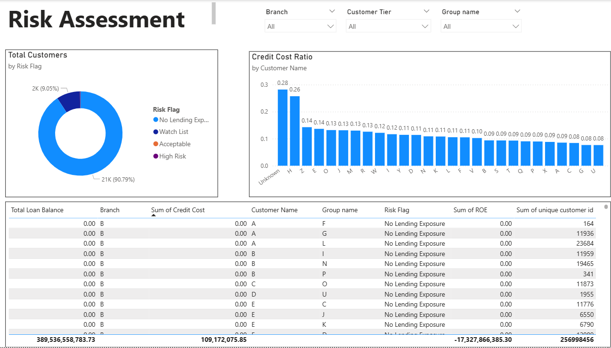
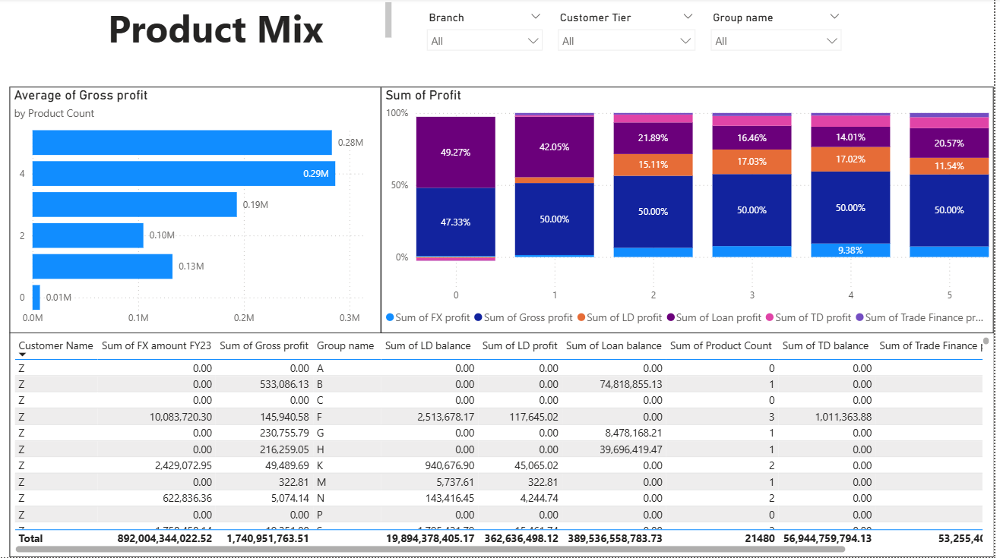

# Corporate Banking Portfolio Analysis (Power BI)

## Overview
This project analyzes a **1-year anonymized corporate banking dataset (USD)** to identify key insights on **profitability, risk exposure, product mix, and wallet share opportunities**.  
The output is a **5-page interactive Power BI report** designed to support business decision-making and relationship manager prioritization.

---

## Tools Used
- Power BI (Data Model, DAX Measures, Dashboards)
- Power Query (Data Cleaning & Transformation)
- SQL (Data extraction / validation)
- Microsoft Excel (Initial data review and checks)

---

## Data Preparation (Power Query)
- Cleaned customer names by replacing irrelevant symbols/numbers with "Unknown"  
- Replaced NA values in numeric fields with nulls to ensure data consistency  
- Performed duplicate checks to ensure data quality  
- Created additional calculated columns for analysis  

---

## Data Model
- Single fact table (Sheet1)  
- Separate Measures table for DAX calculations  
- 25 DAX measures across Profitability, Risk, Product Mix, Wallet Share  

---

## Key Insights
- Revenue is highly concentrated in a small set of customers  
- Majority of customers have no lending exposure (~90%)  
- Significant deposit and lending opportunities remain untapped  
- High-risk exposure is concentrated in specific branches  
- Product usage strongly correlates with profitability  

---

## Customer Tier Strategy
| Tier | Label | Recommended Action |
|------|------|------------------|
| Tier 1 | 🟢 Grow | Deepen wallet share, cross-sell FX & Trade Finance |
| Tier 2 | 🔵 Develop | Introduce new products, increase deposit capture |
| Tier 3 | 🟡 Protect | Retain profit, manage credit cost |
| Tier 4 | 🔴 Review | Restructure or exit loss-making accounts |

---

## 📊 Dashboard Preview

### Overview Dashboard

### Profitability Analysis
[Profitability](./images/Profitability.png)

### Risk Analysis

### Product Mix & Wallet Share

---

## Recommendations
- Focus on Tier 1 & Tier 2 customers for cross-sell opportunities  
- Improve deposit mobilization for high cash balance customers  
- Conduct credit risk review for high-risk segments  
- Increase FX and Trade Finance penetration  

---

## Files Included
- Power BI report (.pbix / .pbip)
- Supporting documentation (Customer Relationship Analysis.pptx)

---

## Author
**Amudha Devi**
